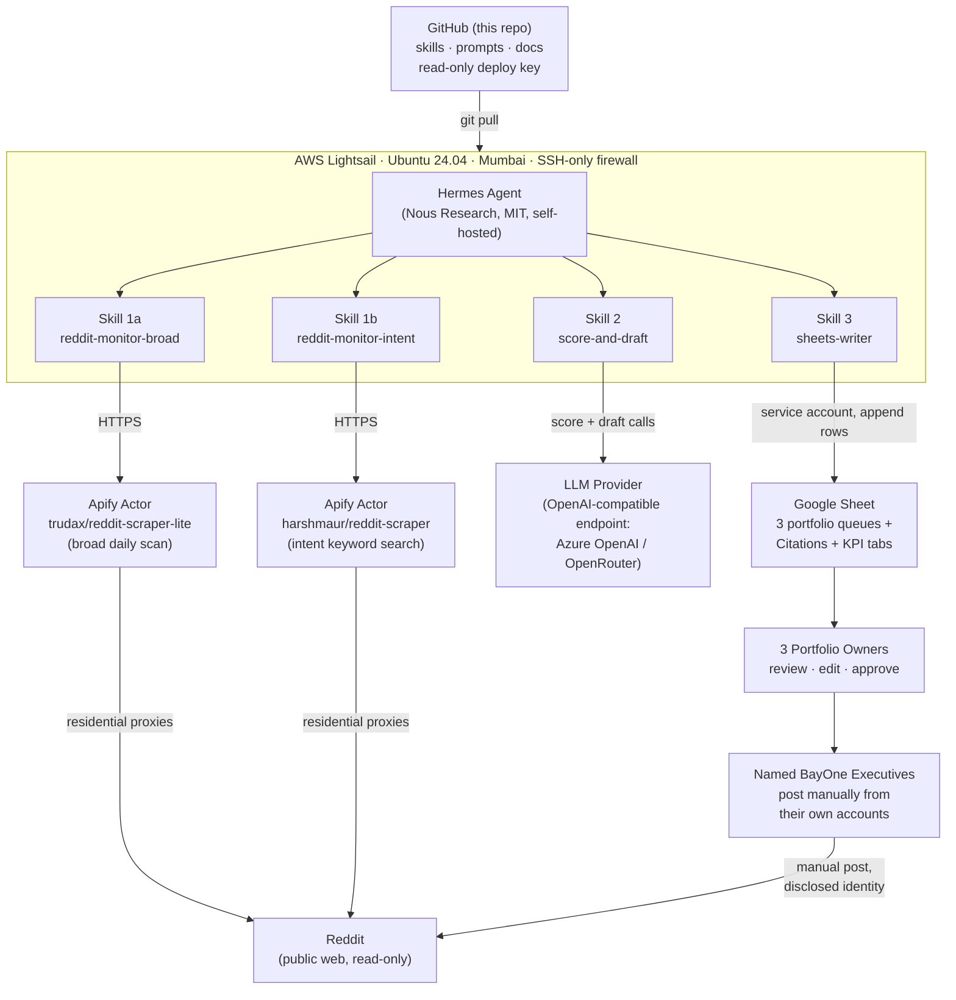
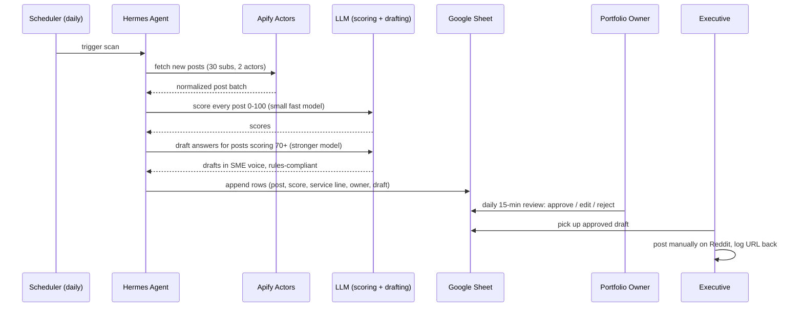
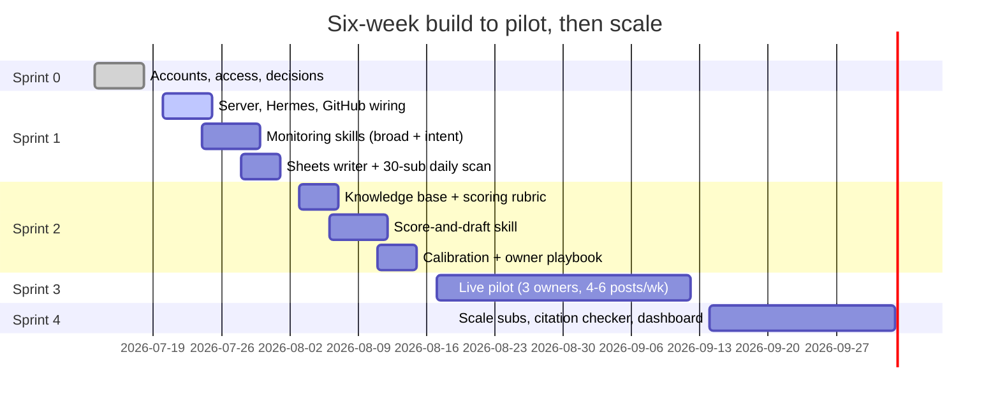

# BayOne Reddit Answer Engine

**An agent-assisted pipeline that earns BayOne citations in AI engines by putting genuine expert answers where those engines actually look: Reddit.**


-8635E9)
-E535AB)


---

## 1. Executive Summary

B2B buyers have moved their research into AI chatbots. When a prospect asks ChatGPT or Perplexity "who should we hire for GCC setup in India" or "best data engineering partner," the engine composes its answer from sources it trusts, and Reddit is the single largest of those sources. BayOne currently appears in none of these answers. Our competitors in every service line already run deliberate playbooks to be the answer AI gives.

This project closes that gap with a monitored, human-controlled pipeline:

1. An AI agent watches 30 carefully mapped subreddits where BayOne's buyers ask questions
2. It scores every post for relevance and buyer intent, then drafts expert answers for the best ones
3. Drafts land in a Google Sheets review queue, split across three portfolio owners
4. Named BayOne executives review, edit, and post manually from their own disclosed Reddit accounts

**The agent never posts. Ever.** That constraint is architectural, not procedural, and it is the reason this approach carries near-zero ban risk while building durable citation authority.

### The market data behind the initiative

| Signal | Value | Source |
|---|---|---|
| B2B software buyers who start research in AI chatbots | 51% | G2 Answer Economy Report, Apr 2026 |
| B2B buyers using LLMs throughout the buying process | 94% | Forrester 2026, corroborated by 6sense 2025 |
| Buyers who changed vendors based on AI guidance | 69% | G2, Mar 2026 |
| Share of AI engine citations sourced from Reddit | ~40% | 5W AI Citation Source Index, May 2026 |
| BayOne's current AI citation count | 0 | Internal baseline audit |

### Targets

| Metric | Pilot exit (Sep 2026) | Oct 2026 |
|---|---|---|
| AI citations per week | First citations detected | 60 |
| Share of AI Voice vs 5 named competitors | Measurable signal | 18 to 20% |
| Expert answers posted per week | 4 to 6 | 8 to 12 |

---

## 2. System Architecture



**The critical edge in that diagram is the last one.** The only path that writes anything to Reddit runs through a human being, logged in as themselves, on their own account. The agent has no Reddit credentials because it needs none.

### Daily pipeline sequence



---

## 3. Component Choices and Why

| Component | Choice | Why this and not the alternative |
|---|---|---|
| Agent framework | **Hermes** (Nous Research, MIT) | Replaced OpenClaw after its disclosed vulnerability record (138+ CVEs incl. a 9.9 CVSS RCE, plaintext credential storage, compromised skill marketplace, Microsoft advisory against corporate use). Hermes runs Docker-sandboxed, keeps all data local, no telemetry, and its skill format follows the agentskills.io open standard |
| Reddit data | **Apify actors** (2) | Reddit's commercial API is $12,000/month and killed the third-party ecosystem. Apify scrapes the public web with residential proxies: no API key, no login, pay-per-result (~$3.40 per 1,000 posts) |
| Broad monitoring | trudax/reddit-scraper-lite | Largest user base of any Reddit actor in the Apify Store, 92.7% success rate, effectively the first-party build |
| Intent monitoring | harshmaur/reddit-scraper | Keyword search catches high-intent phrases ("recommend a vendor," "which agency") that a chronological scan can rank past. Both sources are tagged, giving a built-in A/B on approval rates |
| LLM access | **OpenAI-compatible endpoint** (Azure OpenAI target; OpenRouter used in early dev) | Model-agnostic by design. Small fast model for bulk scoring (hundreds of posts/day), stronger model for the 10 to 15 drafts/day. Provider swap is a config change, zero code |
| Human queue | **Google Sheets** (service account) | Persistent, filterable, doubles as the KPI log, visible to management with zero extra tooling. One robot account with Editor access to one sheet |
| Version control | **GitHub, private repo** | Every prompt and rubric change is a commit, so tuning history is traceable against approval-rate results. Server pulls via read-only deploy key and can never push |
| Hosting | **AWS Lightsail** 2GB, Mumbai | Fixed $12/month, static IP included, checkbox firewall, browser SSH. EC2 grade control is unnecessary for a single-purpose box |

---

## 4. Subreddit Targeting

The pilot list is 30 subreddits, narrowed from a 156-subreddit master map that was built by crawling BayOne's live service pages and mapping each named capability to verified-active communities. Selection filters: (1) maps to a capability BayOne actually sells, (2) verified live with real posting velocity, (3) Primary tier only, meaning buyer presence and intent rather than topical adjacency.

| Portfolio | Owner | Service lines | Subs | Examples |
|---|---|---|---|---|
| A: AI & Data | Marketing lead | AI, Data Engineering, App Modernization | 11 | r/dataengineering (~450K, ~32 posts/day), r/MachineLearning, r/AI_Agents, r/MLOps |
| B: Infra & Reliability | Rachel | SRE, Quality Engineering, Tech & Business Ops | 9 | r/sre, r/devops, r/kubernetes, r/ITManagers |
| C: Experience & Talent | Social Media Manager | UX, PMO, Talent Solutions | 10 | r/UXDesign, r/ProductManagement, r/recruiting, r/startups |

Full list with per-sub rationale: [docs/SUBREDDIT_TARGETING.md](docs/SUBREDDIT_TARGETING.md). Expansion to the Secondary tier (~50 more subs) is gated on pilot precision, not on the calendar.

---

## 5. Scoring and Drafting

Every scraped post gets a 0 to 100 relevance score from a fast model against a rubric covering five questions: is it a genuine question, does it map to a named BayOne capability, is there buyer intent, can it be answered with a specific defensible position, and is the thread fresh enough to matter. Posts scoring 70+ get a full draft from a stronger model.

Drafts are bound by [docs/RULES_OF_ENGAGEMENT.md](docs/RULES_OF_ENGAGEMENT.md), which encodes both community ethics and citation mechanics:

- Helpful first, link last, and rarely. Most answers carry no BayOne link at all
- Specific and data-backed. Vague "it depends" answers do not get cited by AI engines
- Full disclosure. Every posting account is a real named executive with their role in the bio
- BayOne style rules baked in (American English, no em dashes, no AI-writing patterns)

The rubric and drafting prompt live in [prompts/](prompts/) once Sprint 2 lands, and every change to them is a tracked commit. During the pilot, rejected drafts feed a weekly tuning loop, so the git log becomes the record of which prompt changes moved the approval rate.

---

## 6. Security Posture

| Layer | Control |
|---|---|
| Network | Lightsail firewall allows SSH (22) only. No web-facing ports, no gateway, no inbound anything |
| Agent | No third-party or community skills. Only the four skills in this repo, all human-reviewed. Hermes cannot install skills autonomously by design |
| Reddit | Agent holds zero Reddit credentials. Scraping is outbound-only through Apify |
| Secrets | API keys and the Google service-account JSON exist only in the server's local env, entered over SSH. The `.gitignore` blocks `*.json`, `*key*`, `*token*`, `.env` patterns repo-wide |
| GitHub | Server uses a read-only deploy key. It can pull, never push |
| Recovery | Lightsail snapshots at every sprint boundary. $20/month AWS billing alarm |
| Data privacy | Production LLM traffic targets Azure OpenAI, which does not train on customer inputs |

Deeper reasoning: [docs/BAN_RISK_POSTURE.md](docs/BAN_RISK_POSTURE.md) and [docs/ARCHITECTURE.md](docs/ARCHITECTURE.md).

---

## 7. Costs

| Item | Monthly | Notes |
|---|---|---|
| AWS Lightsail (2GB, Mumbai) | $12 | Fixed price, static IP included |
| Apify scraping | $5 to $15 | Pay-per-result at ~$3.40 per 1,000 posts, pilot scan volume |
| LLM (scoring + drafting) | $30 to $50 | Small model for ~200 to 400 scores/day, stronger model for 10 to 15 drafts/day. Under $75 at twice-daily scale |
| Google Sheets, GitHub | $0 | Free tiers |
| **Total** | **~$47 to $77** | No SaaS subscriptions, no per-seat licenses |

For comparison, commercial Reddit engagement SaaS in this category runs $66 to $99+ per month per brand with less control, no data ownership, and no support for our named-SME posting model.

---

## 8. Roadmap and Status



| Milestone | State |
|---|---|
| AWS, OpenRouter, Apify, Google service account, GitHub repo | Done |
| Lightsail server launched, hardened, snapshotted | Done |
| Hermes installed, LLM connectivity verified | Done |
| Server-GitHub read-only deploy key | Done |
| Skill 1a reddit-monitor-broad | Built, awaiting LLM quota to smoke test |
| LLM provider switch to Azure OpenAI | **Blocked on credits access (this request)** |
| Skills 1b, 2, 3 | Next up |

---

## 9. Repository Guide

```
bayone-answer-engine/
├── README.md                        this file
├── CHANGELOG.md                     dated decision and change log
├── docs/
│   ├── ARCHITECTURE.md              full system design and component reasoning
│   ├── SERVER_SETUP.md              provisioning and hardening checklist (live state)
│   ├── GITHUB_WORKFLOW.md           laptop-to-server change flow
│   ├── SUBREDDIT_TARGETING.md       the 30 pilot subs and selection logic
│   ├── RULES_OF_ENGAGEMENT.md       posting ethics, disclosure, style rules
│   ├── BAN_RISK_POSTURE.md          why this design carries near-zero ban risk
│   └── SPRINT_PLAN_SUMMARY.md       condensed plan; full task-level plan in Excel
├── skills/
│   └── reddit-monitor-broad/        SKILL.md + subreddits.json (30-sub config)
└── prompts/                         scoring rubric + drafting prompt (Sprint 2)
```

---

*Maintained by the BayOne Marketing Team. Questions: start with [docs/ARCHITECTURE.md](docs/ARCHITECTURE.md), or ask Imran.*
